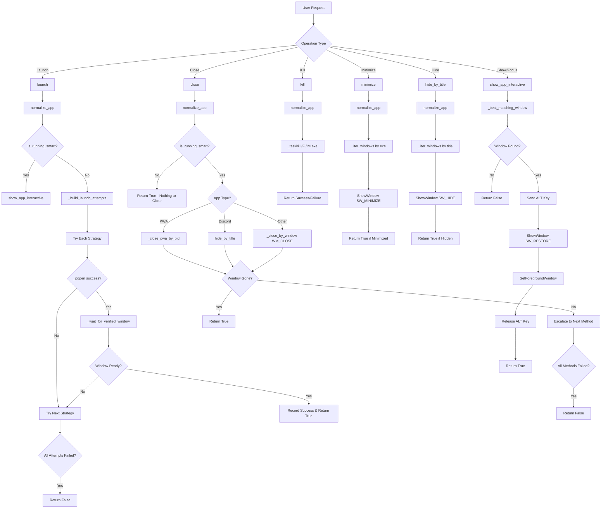
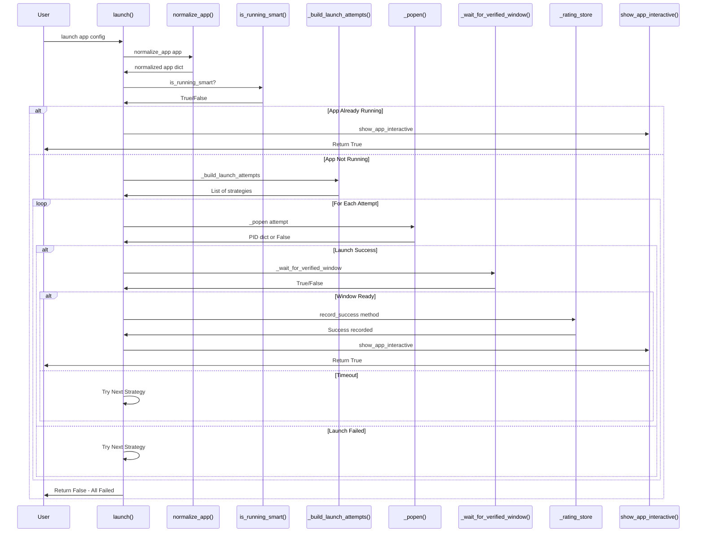
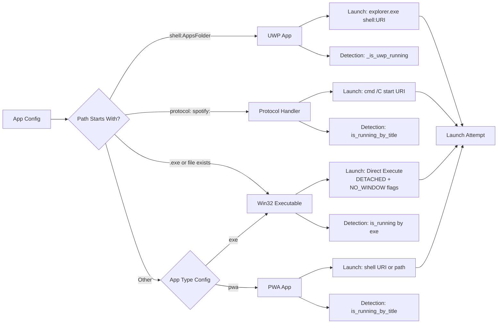
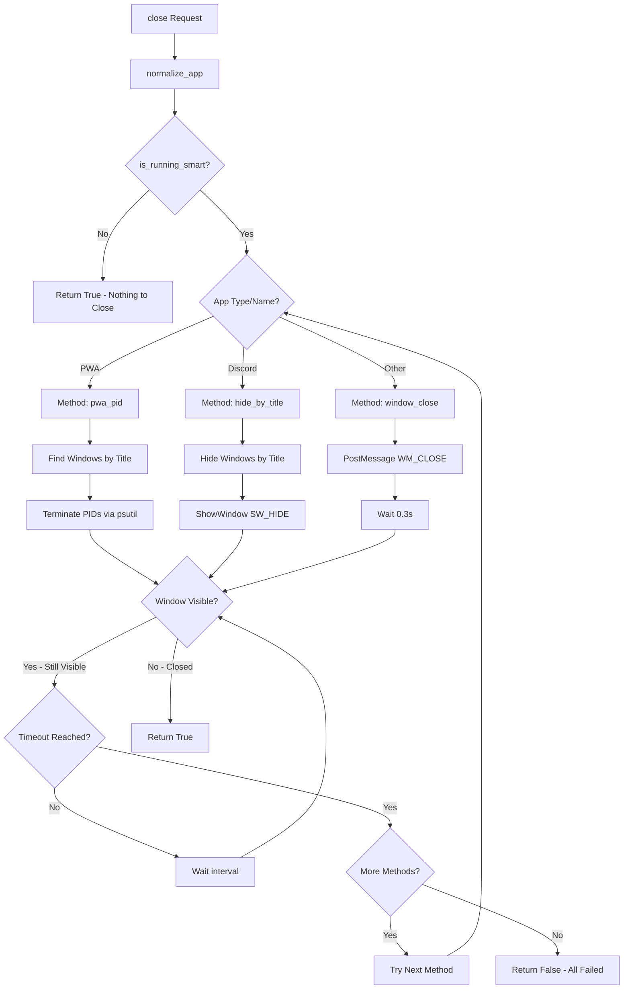
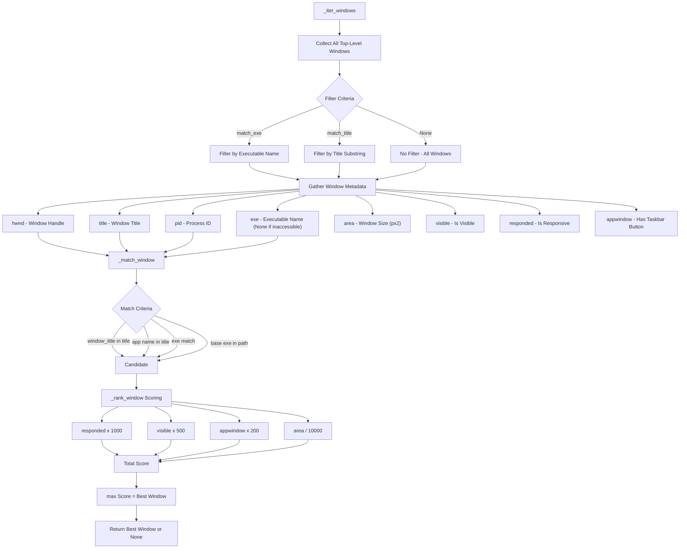
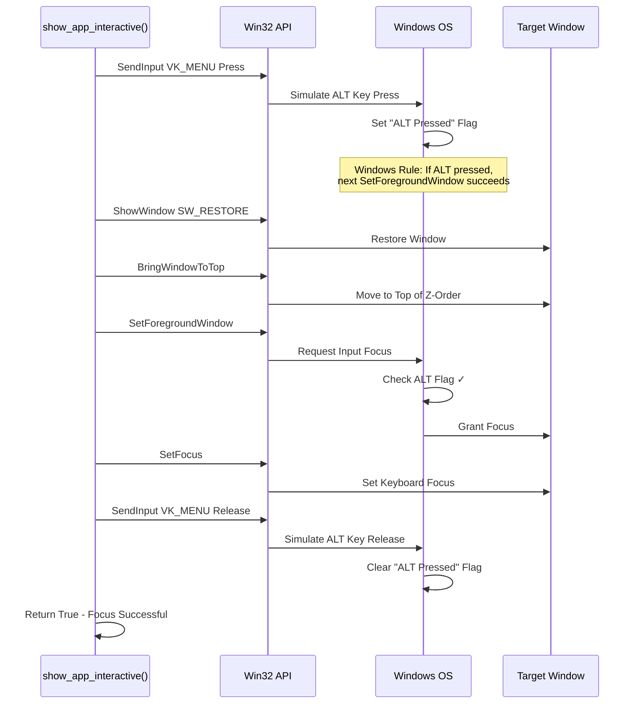
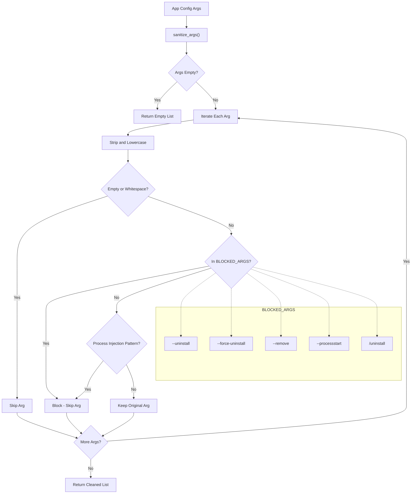
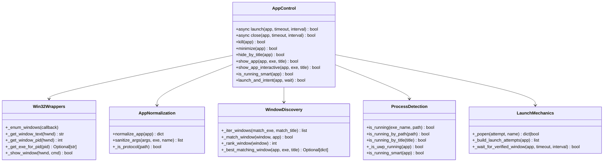
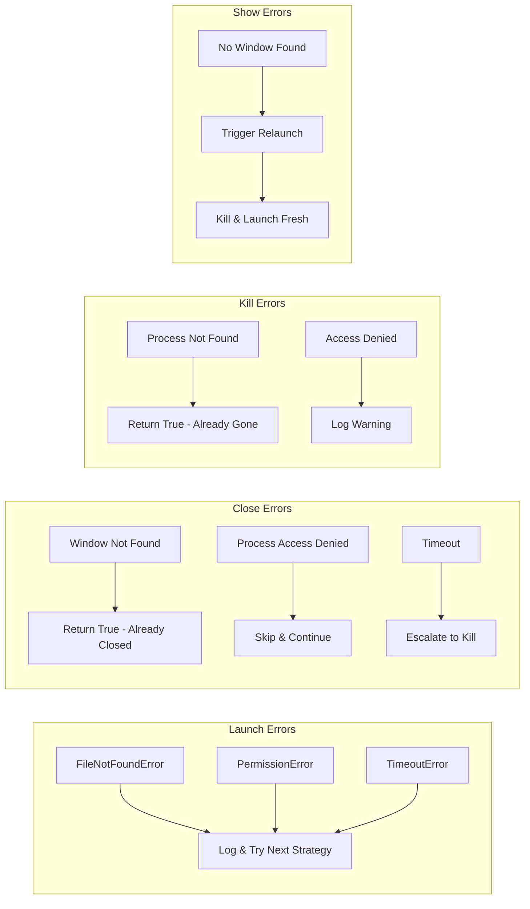

# Windows Application Control Module - Workflow Documentation

## Overview
This module provides async/sync APIs to launch, close, kill, minimize, and manage Windows applications at the OS level. It bridges Python to the Win32 API via ctypes.

## 1. Main Architecture Flowchart



## 2. Launch Workflow Detail



## 3. App Type Detection & Launch Strategy



## 4. Close/Escalation Workflow



## 5. Window Matching & Ranking System



## 6. Focus Stealing Workaround (ALT Key Trick)



## 7. Security & Sanitization Flow



## 8. Complete Module API Summary



## 9. README Quick Reference

### Installation & Dependencies

```python
# Required packages
psutil      # Cross-platform process library
ctypes      # Built-in Win32 API bridge
asyncio     # Async operations
subprocess  # Process management
```

### Basic Usage

```python
from control.apps import launch, close, kill, minimize, show_app_interactive

# Launch an application
app_config = {
    "name": "Chrome",
    "exe": "chrome.exe",
    "path": "C:\\Program Files\\Google\\Chrome\\Application\\chrome.exe",
    "args": ["--new-window"]
}

await launch(app_config, timeout=10)

# Close gracefully
await close(app_config, timeout=10)

# Force kill
kill(app_config)

# Minimize all windows
minimize(app_config)

# Show and focus
show_app_interactive(app_config)
```

### App Configuration Schema

| Field | Required | Description |
|-------|----------|-------------|
| `name` | Yes | Display name for logging |
| `exe` | Yes | Executable filename |
| `path` | Recommended | Full path to executable |
| `args` | No | Launch arguments (sanitized) |
| `app_type` | No | `exe`, `uwp`, `pwa`, `protocol` |
| `window_title` | No | Title for window matching |
| `launch_timeout` | No | Override default timeout |
| `close_timeout` | No | Override close timeout |
| `classification` | Auto | Auto-detected app category |

### App Type Detection

| Type | Path Pattern | Launch Method | Detection |
|------|--------------|---------------|-----------|
| UWP | `shell:AppsFolder\...` | `explorer.exe` | By name/base |
| Protocol | `spotify:`, `ms-settings:` | `cmd /C start` | By title |
| PWA | Custom | Shell URI | By title |
| Win32 | `.exe` or file path | Direct execute | By exe/path |

### Security Features

- **Argument Sanitization**: Blocks uninstall/self-modification flags
- **Blocked Args**: `--uninstall`, `--remove`, `--processstart`, `/uninstall`
- **Process Isolation**: `DETACHED` + `NO_WINDOW` flags for silent launches
- **Access Control**: Handles `AccessDenied` for protected processes
- **Type Safety**: `_get_exe_for_pid()` returns `Optional[str]` (None on error)

## 10. Error Handling Matrix



## 11. Key Changes in Refactored Version

### Code Quality Improvements
- ✅ **Removed duplicate imports** - Single source of truth
- ✅ **Removed duplicate WIN32 constants** - Consolidated definitions
- ✅ **Removed duplicate helper functions** - One canonical implementation
- ✅ **Fixed type annotations** - `_get_exe_for_pid()` returns `Optional[str]`
- ✅ **Better error handling** - None vs empty string for inaccessible processes

### Architecture Improvements
- 📦 **Single `_iter_windows()` function** - Comprehensive metadata collection
- 📦 **Single `_CATEGORY_RUNNING_CHECKS`** - Unified dispatch table
- 📦 **Cleaner module structure** - No redundant code blocks

### Behavior Changes
- ⚠️ **None** - All workflows and APIs remain identical
- ⚠️ **Backward compatible** - No breaking changes to public API


---
*This documentation provides a complete visual and textual reference for the Windows Application Control Module workflow. All diagrams can be rendered in any Mermaid-compatible viewer (GitHub, VS Code, Mermaid Live Editor, etc.).*

