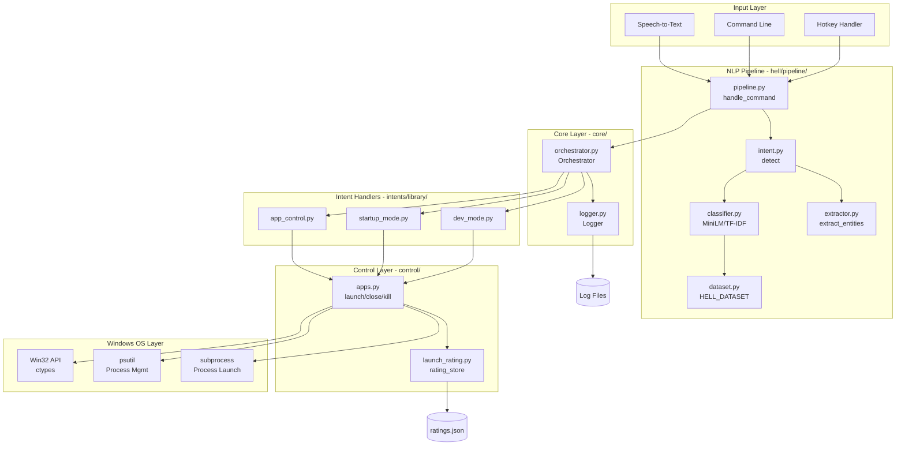
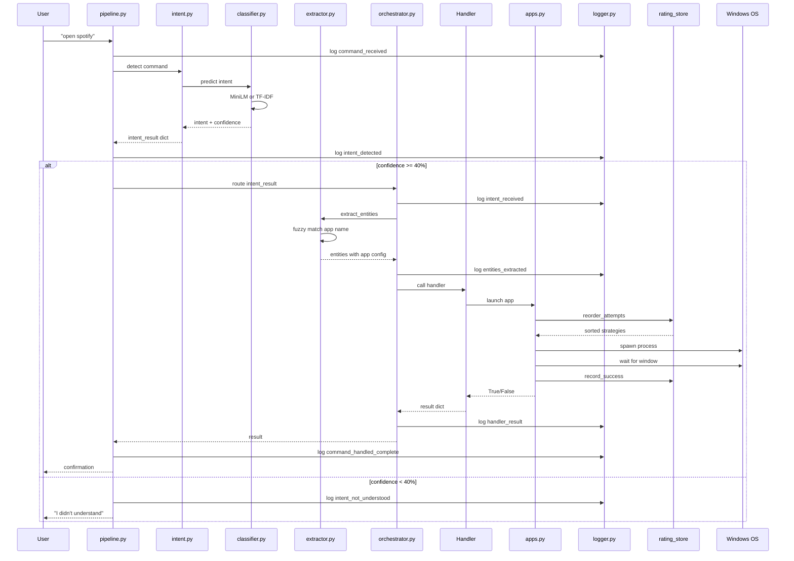
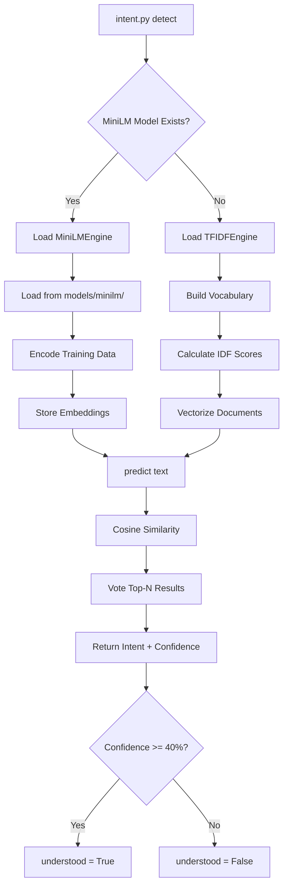
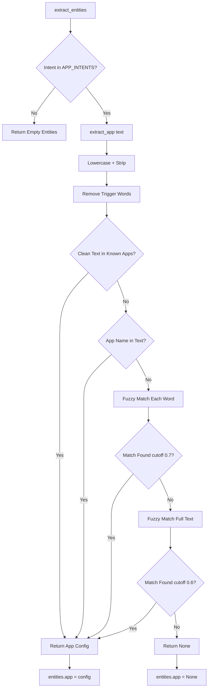
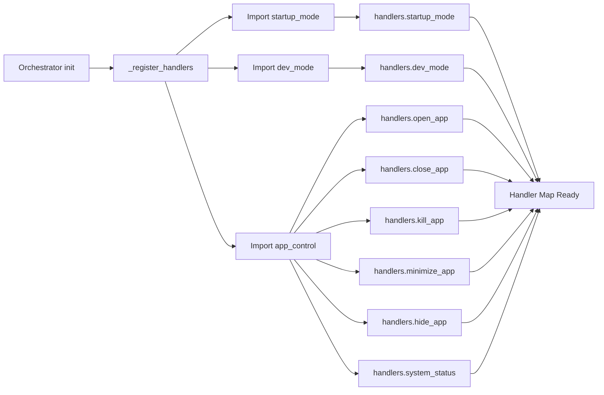
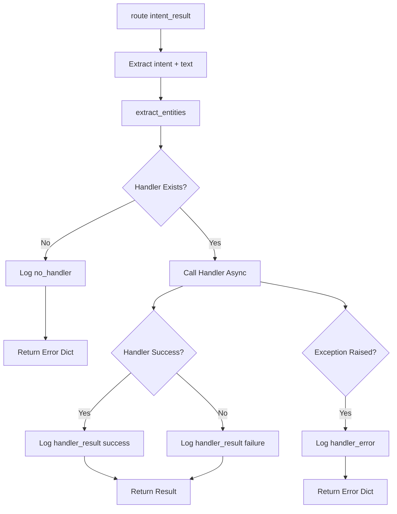
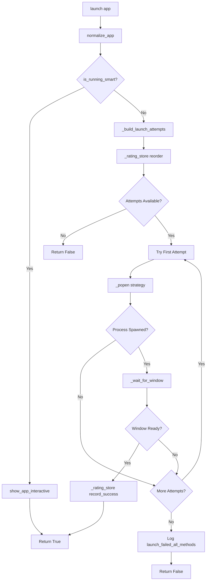
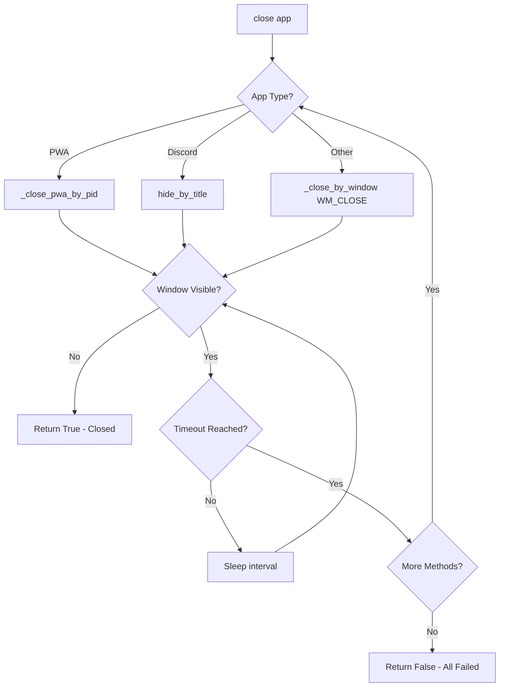
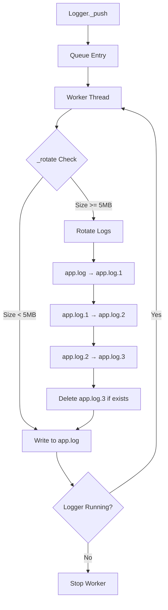
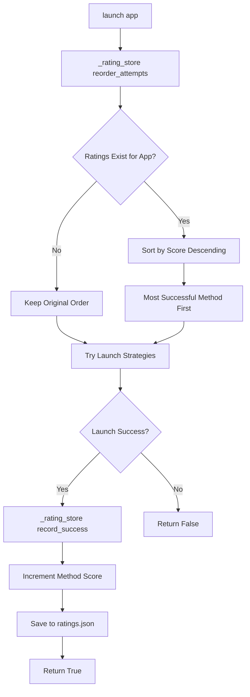

# HELL Automation Framework - Complete System Documentation

## 1. System Overview

**HELL** is a modular Windows automation framework that interprets natural language commands and executes system-level actions. It bridges high-level intent classification with low-level Win32 API operations through a layered pipeline architecture.

### Core Capabilities
| Layer | Function | Key Files |
|-------|----------|-----------|
| **NLP Pipeline** | Intent classification + entity extraction | `intent.py`, `classifier.py`, `extractor.py` |
| **Core Router** | Command orchestration + logging | `pipeline.py`, `orchestrator.py`, `logger.py` |
| **App Control** | Windows OS-level operations | `apps.py`, `launch_rating.py` |
| **Intent Handlers** | Business logic for each command type | `app_control.py`, `startup_mode.py`, `dev_mode.py` |

---

## 2. Complete System Architecture



---

## 3. Command Flow - End to End



---

## 4. NLP Pipeline Detail

### 4.1 Intent Classification Engine Selection



### 4.2 Entity Extraction Flow



### 4.3 Training Dataset Structure

| Intent Category | Anchor Grams | Example Phrases | Count |
|-----------------|--------------|-----------------|-------|
| `startup_mode` | "startup", "boot", "initialize" | "run startup", "boot sequence", "fire up everything" | ~80 |
| `dev_mode` | "dev mode", "coding", "vscode" | "start coding", "open my project", "launch vscode" | ~70 |
| `game_mode` | "game mode", "ping", "servers" | "check ping", "lets game", "optimize for gaming" | ~60 |
| `open_app` | "open", "launch", "start" | "open spotify", "launch discord", "fire up chrome" | ~50 |
| `close_app` | "close", "exit", "quit", "stop" | "close spotify", "exit discord", "quit steam" | ~50 |
| `kill_app` | "kill", "force", "terminate" | "kill discord", "force kill chrome", "terminate spotify" | ~40 |
| `hide_app` | "hide", "minimize", "desktop" | "hide discord", "show desktop", "clear screen" | ~50 |
| `system_status` | "cpu", "ram", "disk", "status" | "check cpu", "system status", "ram usage" | ~80 |
| `stop_hell` | "stop", "shutdown", "goodbye" | "stop hell", "shutdown", "goodbye" | ~50 |

**Total Dataset:** ~530 training examples

---

## 5. Orchestrator Routing

### 5.1 Handler Registration



### 5.2 Route Execution Flow



---

## 6. Application Control Workflows

### 6.1 Launch Strategy Pipeline



### 6.2 App Type Detection Matrix

| App Type | Path Pattern | Launch Method | Detection Strategy |
|----------|--------------|---------------|-------------------|
| **Win32** | `.exe` or file path | Direct `subprocess.Popen` | `is_running` by exe name |
| **UWP** | `shell:AppsFolder\...` | `explorer.exe` shell URI | `_is_uwp_running` by name/base |
| **Protocol** | `spotify:`, `ms-settings:` | `cmd /C start` | `is_running_by_title` |
| **PWA** | Config type `pwa` | Shell URI or path | `is_running_by_title` |
| **Browser** | Chrome/Firefox/Edge | Direct execute | `is_running_firefox_style` |

### 6.3 Close Escalation Chain



---

## 7. Logging System

### 7.1 Log Event Categories

| Layer | Event Name | Level | Context Fields |
|-------|------------|-------|----------------|
| **Pipeline** | `command_received` | INFO | raw |
| **Pipeline** | `intent_detected` | INFO | intent, confidence, understood |
| **Pipeline** | `intent_not_understood` | WARNING | intent, confidence |
| **Orchestrator** | `orchestrator_initialized` | INFO | - |
| **Orchestrator** | `handlers_registered` | INFO | count |
| **Orchestrator** | `intent_received` | INFO | intent, confidence, text |
| **Orchestrator** | `entities_extracted` | DEBUG | intent, entities |
| **Orchestrator** | `handler_selected` | INFO | intent, handler |
| **Orchestrator** | `handler_result` | INFO | intent, success |
| **Orchestrator** | `handler_error` | ERROR | intent, error |
| **App Control** | `launch_start` | INFO | app, path, exe, args |
| **App Control** | `launch_attempt` | INFO | app, method, path |
| **App Control** | `launch_success` | INFO | app |
| **App Control** | `launch_failed_all_methods` | ERROR | app |
| **App Control** | `close_attempt` | INFO | app |
| **Startup** | `startup_mode_begin` | INFO | count |
| **Startup** | `startup_launch_success` | INFO | app |
| **Startup** | `startup_launch_failed` | WARNING | app, result |
| **Startup** | `startup_mode_complete` | INFO | success, failed |
| **Dev Mode** | `dev_mode_begin` | INFO | count |
| **Dev Mode** | `dev_launch_success` | INFO | app |
| **Dev Mode** | `dev_mode_complete` | INFO | success, failed |

### 7.2 Log Storage Architecture



---

## 8. Launch Rating System

### 8.1 Rating Storage Flow



### 8.2 Rating File Structure

```json
{
  "Spotify": {
    "path": 15,
    "exe": 8,
    "shell": 3
  },
  "Discord": {
    "path": 22,
    "shell": 5
  },
  "Chrome": {
    "path": 30,
    "exe": 12
  }
}
```

---

## 9. Handler Comparison Matrix

| Feature | app_control | startup_mode | dev_mode |
|---------|-------------|--------------|----------|
| **Trigger** | Voice/Text Command | System Boot | Manual/Debug |
| **App Source** | Entity Extraction | config.startup_apps | config.dev_trigger_apps |
| **Launch Method** | `launch()` | `launch_and_intent()` | `launch()` |
| **Auto Close** | No | Yes (after 15s) | No |
| **Parallel** | Single App | Yes (asyncio.gather) | Yes (asyncio.gather) |
| **Error Handling** | Return False | Log + Continue | Log + Continue |
| **Return Type** | dict {success, response} | None | dict {success, reason} |
| **Use Case** | Daily Operations | Boot Initialization | Development Testing |

---

## 10. Security Features

### 10.1 Argument Sanitization

```mermaid
flowchart TD
    A[sanitize_args] --> B{Args Empty?}
    
    B -->|Yes| C[Return Empty List]
    B -->|No| D[Iterate Each Arg]
    
    D --> E[Strip + Lowercase]
    E --> F{Empty/Whitespace?}
    F -->|Yes| G[Skip Arg]
    F -->|No| H{In BLOCKED_ARGS?}
    
    H -->|Yes| I[Block - Skip Arg]
    H -->|No| J{Process Injection Pattern?}
    
    J -->|Yes| I
    J -->|No| K[Keep Original Arg]
    
    G --> L{More Args?}
    I --> L
    K --> L
    
    L -->|Yes| D
    L -->|No| M[Return Cleaned List]
    
    subgraph BLOCKED_ARGS
        N[--uninstall]
        O[--force-uninstall]
        P[--remove]
        Q[--processstart]
        R[/uninstall]
    end
    
    H -.-> N
    H -.-> O
    H -.-> P
    H -.-> Q
    H -.-> R
```

### 10.2 Process Isolation Flags

| Flag | Value | Purpose |
|------|-------|---------|
| `DETACHED` | `0x00000008` | Process has no console; runs independently |
| `NO_WINDOW` | `0x08000000` | Don't create window for console apps |
| **Combined** | Both | Silent background launch without console flash |

---

## 11. API Reference

### 11.1 Pipeline Entry Point

```python
# hell/pipeline/pipeline.py
async def handle_command(command: str):
    """
    Entry point for all commands.
    Called by STT detector, hotkey handler, or CLI.
    """
```

### 11.2 Intent Detection

```python
# hell/pipeline/intent.py
def detect(text: str) -> dict:
    """
    Returns: {
        "intent": str,
        "confidence": float,
        "text": str,
        "understood": bool
    }
    """
```

### 11.3 Entity Extraction

```python
# hell/pipeline/extractor.py
def extract_entities(intent: str, text: str) -> dict:
    """
    Returns: {
        "app": dict | None,
        "intent": str
    }
    """
```

### 11.4 Orchestrator

```python
# core/orchestrator.py
class Orchestrator:
    async def route(self, intent_result: dict) -> dict:
        """
        Main routing function.
        Returns: {
            "success": bool,
            "reason": str,
            "intent": str
        }
        """
```

### 11.5 App Control Functions

```python
# control/apps.py
async def launch(app: dict, timeout: int = 5, interval: int = 2) -> bool
async def close(app: dict, timeout: int = 10, interval: int = 1) -> bool
def kill(app: dict) -> bool
def minimize(app: dict) -> bool
def hide_by_title(app: dict) -> bool
def show_app_interactive(app: dict, exe, window_title) -> bool
def is_running_smart(app: dict) -> bool
```

### 11.6 Intent Handlers

```python
# intents/library/app_control.py
async def run(entities: dict) -> dict

# intents/library/startup_mode.py
async def run(entities: dict = None) -> None

# intents/library/dev_mode.py
async def run(entities: dict = None) -> dict
```

### 11.7 Logger

```python
# core/logger.py
class Logger:
    def info(self, msg, **ctx)
    def warning(self, msg, **ctx)
    def error(self, msg, **ctx)
    def export_logs(self) -> str  # Returns zip path
```

---

## 12. Configuration Schema

### 12.1 App Configuration

```python
{
    "name": "Chrome",              # Display name & matching token
    "exe": "chrome.exe",           # Process name for detection
    "exe_name": "chrome.exe",      # Alternative key
    "path": "C:\\Program Files\\...\\chrome.exe",
    "resolved_path": "...",        # Post-resolution absolute path
    "args": ["--new-window"],      # Launch arguments (sanitized)
    "app_type": "exe",             # exe, uwp, pwa, protocol
    "window_title": "Chrome",      # For window matching
    "launch_timeout": 10,          # Override default timeout
    "close_timeout": 5,            # Override close timeout
    "hide_by": "exe"               # hide by exe or title
}
```

### 12.2 Startup App Configuration

```python
{
    "name": "Spotify",
    "exe": "spotify.exe",
    "action": "launch_and_intent",  # Auto-close after 15s
    "launch_timeout": 15,
    "args": []
}
```

### 12.3 Dev Trigger Configuration

```python
# config.dev_trigger_apps() returns:
["code.exe", "terminal.exe", "chrome.exe"]
# These are matched against installed_apps exe_name
```

---

## 13. Error Handling Matrix

| Error Type | Layer | Handling Strategy | Log Level |
|------------|-------|-------------------|-----------|
| `FileNotFoundError` | apps.py | Try next launch strategy | ERROR |
| `PermissionError` | apps.py | Try next launch strategy | ERROR |
| `TimeoutError` | apps.py | Escalate to next method | WARNING |
| `Intent Not Understood` | pipeline.py | Return without action | WARNING |
| `App Not Found` | extractor.py | Return None, handler returns error | INFO |
| `Handler Exception` | orchestrator.py | Catch, log, return error dict | ERROR |
| `Process Access Denied` | apps.py | Skip and continue | WARNING |
| `Rating Store Unavailable` | apps.py | Continue without rating | WARNING |

---

## 14. Quick Start Guide

### 14.1 Adding a New Intent

1. **Add Training Data** (`dataset.py`):
```python
("new command example", "new_intent"),
```

2. **Create Handler** (`intents/library/new_intent.py`):
```python
async def run(entities: dict) -> dict:
    # Implementation
    return {"success": True, "response": "Done"}
```

3. **Register Handler** (`orchestrator.py`):
```python
from intents.library.new_intent import run as new_run
self.handlers["new_intent"] = new_run
```

### 14.2 Adding a New App

1. **Add to Config** (`config.py`):
```python
installed_apps = [
    {
        "name": "NewApp",
        "exe": "newapp.exe",
        "path": "C:\\Path\\to\\newapp.exe",
        "app_type": "exe"
    }
]
```

2. **Test Extraction**:
```python
from hell.pipeline.extractor import extract_app
app = extract_app("open newapp")
```

### 14.3 Debugging

```python
# Enable debug logging
from core.logger import logger
logger.set_debug(True)

# Export logs for analysis
zip_path = logger.export_logs()

# Test intent detection
from hell.pipeline.intent import detect
result = detect("open spotify")
print(result)
```

---

## 15. Dependencies

| Package | Version | Purpose |
|---------|---------|---------|
| `psutil` | Latest | Process management |
| `ctypes` | Built-in | Win32 API bridge |
| `asyncio` | Built-in | Async operations |
| `subprocess` | Built-in | Process management |
| `sentence-transformers` | Latest | MiniLM embeddings (optional) |
| `scikit-learn` | Latest | TF-IDF fallback |
| `numpy` | Latest | Vector operations |
| `difflib` | Built-in | Fuzzy matching |

---

## 16. File Structure

```
HELL/
├── hell/
│   └── pipeline/
│       ├── pipeline.py      # Command entry point
│       ├── intent.py        # Intent detection
│       ├── classifier.py    # MiniLM/TF-IDF engines
│       ├── dataset.py       # Training data
│       └── extractor.py     # Entity extraction
├── core/
│   ├── orchestrator.py      # Command router
│   └── logger.py            # Logging system
├── control/
│   ├── apps.py              # Windows API control
│   └── launch_rating.py     # Success rating storage
├── intents/
│   └── library/
│       ├── app_control.py   # App operations
│       ├── startup_mode.py  # Boot initialization
│       └── dev_mode.py      # Dev workflow
├── config.py                # App configurations
├── runtime/
│   ├── logs/                # Log files
│   └── attemptRatings/      # Rating storage
└── models/
    └── minilm/              # MiniLM model (optional)
```

---

This documentation provides a complete reference for the HELL Automation Framework, blending all modules into a cohesive system overview with workflows, API references, and implementation guides.