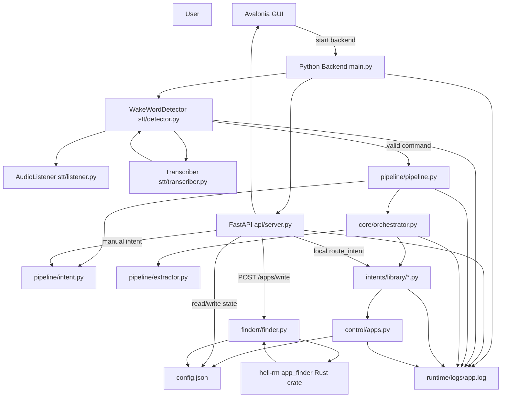
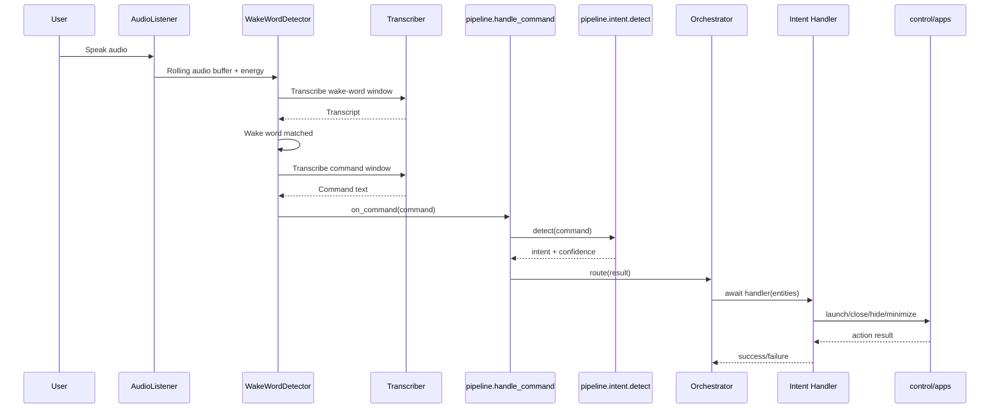
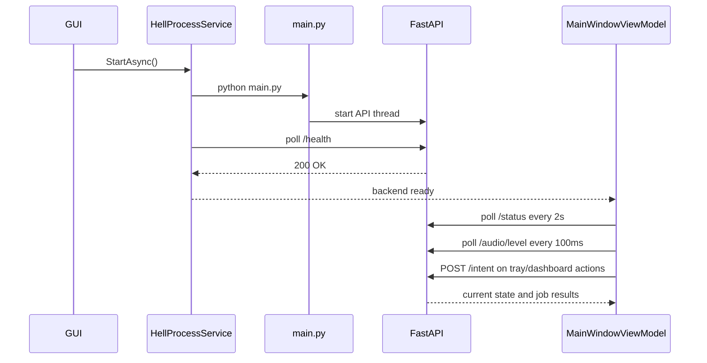
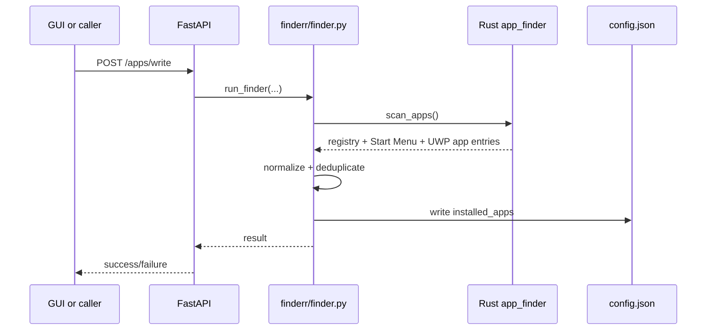

# HELL Workflow Diagram

## System Workflow

## Voice Command Path

## GUI Control Path

## App Discovery Path

## Notes

- STT-submitted commands go through `core/orchestrator.py`.
- API-submitted commands currently use a separate local router in `api/server.py`.
- The app discovery diagram reflects the intended flow, but the current `/apps/write` implementation needs a small code fix because `run_finder()` is called without the `apps` argument its current signature expects.
